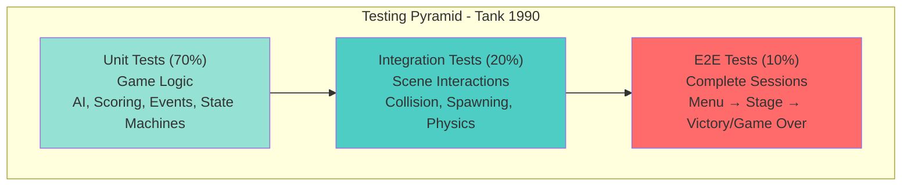
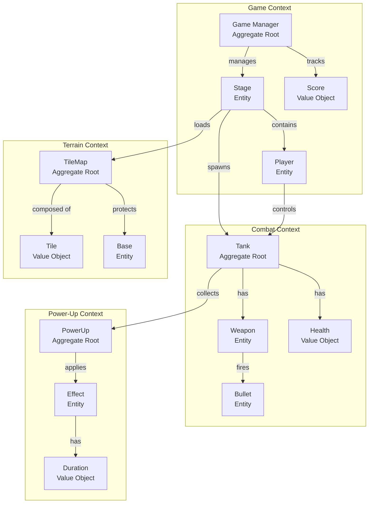

# Tank 1990 - MVP Specification

## Godot Adaptation for Desktop & Mobile

**Version:** 1.0.0  
**Date:** November 23, 2025  
**Project:** Tank 1990 Remake

---

## Executive Summary

Adaptation of the classic NES game Tank 1990 (Battle City) for desktop and mobile platforms using Godot Engine. The MVP focuses on core tank combat mechanics, stage progression, and cross-platform controls while maintaining the retro aesthetic and addictive gameplay that made the original a success.

---

## Problem Statement

Tank 1990 remains a beloved classic, but modern players lack accessible versions optimized for current platforms. The original's simple yet engaging gameplay loop—defend your base while destroying enemy tanks—has timeless appeal but needs adaptation for touchscreen controls and contemporary expectations around progression systems and visual polish.

---

## Target Users

**Primary Audience:**

- Retro gaming enthusiasts (ages 25-45) seeking nostalgia
- Casual mobile gamers looking for quick, skill-based sessions
- Desktop gamers interested in arcade-style action

**User Characteristics:**

- Familiar with classic arcade mechanics or willing to learn simple controls
- Value gameplay over graphics but appreciate polished presentation
- Play sessions: 5-20 minutes (mobile), 30-60 minutes (desktop)
- Mix of solo players and those seeking competitive high scores

---

## Solution Overview

A faithful remake of Tank 1990 in Godot with modernized features:

**Core Experience:** Top-down tank combat defending your base ("Eagle") from waves of enemy tanks across 35 stages. Players navigate maze-like terrain with destructible elements, collect power-ups, and progress through increasingly difficult levels.

**Key Differentiators:**

- Responsive touch controls alongside traditional input
- Cloud save/local progression system
- Polished pixel art with optional visual effects
- Scalable difficulty for accessibility
- Leaderboard integration (Phase 2)

---

## MVP Features

### 1. Core Gameplay Mechanics

#### Tank Controls

- **Movement:** 4-directional movement (up, down, left, right)
- **Shooting:** Fire bullets in facing direction
- **Speed:** Base speed with power-up enhancements
- **Collision:** Tank stops when hitting walls, other tanks, or water

#### Player Tank

- Starts at base of screen
- 3 lives per game
- Can be upgraded through power-ups (up to 3 stars)
- Respawns after death with brief invulnerability

#### Enemy Tanks

- 4 types with varying attributes:
  - **Basic:** Slow, weak (brown)
  - **Fast:** Quick movement (gray)
  - **Power:** Takes 4 hits to destroy (green)
  - **Armored:** Takes multiple hits, drops power-ups (red)
- 20 enemies per stage
- Maximum 4 enemies on screen simultaneously
- Spawn from 3 designated locations at top of screen
- AI behaviors: patrol, chase player, target base

#### Base Defense

- "Eagle" base at bottom center of screen
- Surrounded by destructible brick walls
- Game over if base is destroyed
- Stage complete when all 20 enemies defeated

### 2. Terrain & Environment

#### Tile Types

- **Brick:** Destructible by bullets (player & enemy)
- **Steel:** Indestructible (unless player has special power-up)
- **Water:** Impassable obstacle
- **Forest:** Provides camouflage (tanks hidden while inside)
- **Ice:** Tanks slide with momentum

#### Stage Design

- 35 pre-designed stages with increasing difficulty
- Grid-based layout (26x26 tiles)
- Mix of defensive and offensive positioning challenges

### 3. Power-Up System

Power-ups appear when destroying special red enemy tanks:

- **Star:** Upgrade tank level (max 3)
  - Level 1: Faster bullets
  - Level 2: Can fire 2 bullets simultaneously
  - Level 3: Can destroy steel walls
- **Grenade:** Destroys all enemies on screen
- **Helmet:** Temporary invulnerability (6 seconds)
- **Shovel:** Temporary steel walls around base (10 seconds)
- **Tank:** Extra life
- **Timer:** Freezes all enemies (6 seconds)

### 4. User Interface

#### Main Menu

- Start Game
- Stage Select (unlocked stages only)
- Settings
- Quit

#### HUD (In-Game)

- Player lives remaining
- Current stage number
- Enemy counter (remaining/spawned)
- Current score
- Power-up indicator
- Pause button

#### Pause Menu

- Resume
- Restart Stage
- Settings
- Quit to Menu

#### Game Over Screen

- Final score
- Stage reached
- Retry / Main Menu options

### 5. Progression System

- **Stage Progression:** Linear unlock (beat stage N to unlock N+1)
- **Score System:**
  - Basic tank: 100 points
  - Fast tank: 200 points
  - Power tank: 300 points
  - Armored tank: 400 points
  - Stage completion bonus: 500 points
- **Save System:** Auto-save after each stage completion

### 6. Input & Controls

#### Desktop (Keyboard)

- Arrow Keys / WASD: Movement
- Space / Enter: Fire
- P / Escape: Pause

#### Mobile (Touch)

- Virtual D-pad (left side): Movement
- Fire button (right side): Shoot
- Pause icon (top-right corner)
- Optional: Swipe gestures for movement

#### Gamepad Support

- Left stick/D-pad: Movement
- A/Cross button: Fire
- Start: Pause

### 7. Audio

- Background music per stage group (stages 1-10, 11-20, etc.)
- Sound effects:
  - Tank movement
  - Bullet fire
  - Explosion (tank/terrain)
  - Power-up collection
  - Base destruction
  - Stage clear
- Volume controls in settings
- Mute option

### 8. Settings

- Sound volume (master, music, SFX)
- Control customization (desktop)
- Visual effects toggle (particles, screen shake)
- Language (English initially)
- Reset progress (with confirmation)

---

## User Stories & Acceptance Criteria

### Epic 1: Core Tank Combat

**US1.1:** As a player, I want to control my tank with responsive input so I can navigate the battlefield effectively.

**Acceptance Criteria:**

- **Given** the game is running, **when** I press directional input, **then** tank moves in that direction at consistent speed
- **Given** tank is moving, **when** I release input, **then** tank stops immediately
- **Given** tank faces a direction, **when** I press fire, **then** bullet shoots in that direction
- **Edge cases:** Tank cannot move through solid obstacles; inputs are buffered for smooth diagonal prevention

**US1.2:** As a player, I want to destroy enemy tanks so I can progress through stages.

**Acceptance Criteria:**

- **Given** bullet hits basic enemy, **when** collision occurs, **then** enemy explodes and is removed
- **Given** bullet hits power tank, **when** collision occurs, **then** hit counter decrements (4 hits total)
- **Given** all stage enemies defeated, **when** last enemy destroyed, **then** stage complete screen appears
- **Edge cases:** Bullets despawn after hitting targets or screen edges; multiple simultaneous hits register correctly

### Epic 2: Base Defense

**US2.1:** As a player, I want to protect my base so I can continue playing.

**Acceptance Criteria:**

- **Given** enemy bullet hits base, **when** collision detected, **then** game over sequence triggers
- **Given** enemy tank reaches base, **when** collision detected, **then** game over sequence triggers
- **Given** base walls intact, **when** bullets approach, **then** walls absorb damage
- **Edge cases:** Base invulnerability during power-up activation; visual feedback for base danger

**US2.2:** As a player, I want to use the shovel power-up so I can temporarily protect my base.

**Acceptance Criteria:**

- **Given** shovel collected, **when** activated, **then** brick walls replaced with steel for 10 seconds
- **Given** shovel active, **when** timer expires, **then** walls revert to brick
- **Given** shovel active, **when** enemy bullets hit, **then** bullets bounce off steel
- **Edge cases:** Timer visible; multiple shovels extend duration; base remains protected during countdown

### Epic 3: Terrain Interaction

**US3.1:** As a player, I want to destroy brick walls so I can create strategic paths.

**Acceptance Criteria:**

- **Given** bullet hits brick, **when** collision occurs, **then** brick tile disappears
- **Given** tank fires at brick cluster, **when** multiple bricks hit, **then** each brick destroyed individually
- **Given** steel wall hit, **when** player lacks power-up, **then** bullet bounces/disappears
- **Edge cases:** Partial brick destruction creates new paths; destruction animation plays

**US3.2:** As a player, I want terrain variety so gameplay remains engaging.

**Acceptance Criteria:**

- **Given** tank enters water, **when** collision detected, **then** tank cannot pass
- **Given** tank enters forest, **when** inside, **then** tank sprite partially hidden
- **Given** tank enters ice, **when** moving, **then** tank slides with momentum
- **Edge cases:** Forest doesn't prevent damage; ice slide stops at obstacles

### Epic 4: Power-Up System

**US4.1:** As a player, I want to collect power-ups so I can gain temporary advantages.

**Acceptance Criteria:**

- **Given** armored enemy destroyed, **when** explosion completes, **then** random power-up spawns
- **Given** tank touches power-up, **when** collision occurs, **then** effect activates and icon disappears
- **Given** helmet collected, **when** activated, **then** tank gains 6 seconds invulnerability with visual indicator
- **Edge cases:** Power-ups timeout after 20 seconds; multiple power-ups don't overlap effects improperly

**US4.2:** As a player, I want tank upgrades so I can become more powerful.

**Acceptance Criteria:**

- **Given** first star collected, **when** activated, **then** bullets travel faster
- **Given** second star collected, **when** activated, **then** can fire 2 bullets simultaneously
- **Given** third star collected, **when** activated, **then** can destroy steel walls
- **Edge cases:** Upgrades persist until death; visual indicator shows current level

### Epic 5: Stage Progression

**US5.1:** As a player, I want to advance through stages so I experience increasing challenge.

**Acceptance Criteria:**

- **Given** stage completed, **when** victory animation ends, **then** next stage unlocks and starts
- **Given** game over occurs, **when** retry selected, **then** restart current stage with fresh lives
- **Given** multiple stages beaten, **when** returning to menu, **then** progress is saved
- **Edge cases:** Stage select shows locked/unlocked states; score persists across stages

**US5.2:** As a player, I want varied stage layouts so gameplay doesn't become repetitive.

**Acceptance Criteria:**

- **Given** new stage loads, **when** game starts, **then** unique terrain layout appears
- **Given** stage number increases, **when** enemies spawn, **then** more difficult types appear
- **Given** later stages played, **when** game starts, **then** faster enemy spawn rates occur
- **Edge cases:** Stage 35 is hardest; each stage has consistent layout per playthrough

### Epic 6: Mobile-Specific Features

**US6.1:** As a mobile player, I want touch controls so I can play without physical buttons.

**Acceptance Criteria:**

- **Given** touch input on D-pad, **when** direction touched, **then** tank moves accordingly
- **Given** fire button pressed, **when** tapped, **then** tank shoots
- **Given** playing on phone, **when** UI appears, **then** controls are thumb-reachable and non-overlapping
- **Edge cases:** D-pad supports diagonal rejection; button size adjustable in settings

**US6.2:** As a mobile player, I want the game to pause automatically so I don't lose progress during interruptions.

**Acceptance Criteria:**

- **Given** phone call received, **when** app loses focus, **then** game pauses automatically
- **Given** game paused by interrupt, **when** app regains focus, **then** game remains paused until resume pressed
- **Given** battery low, **when** warning appears, **then** game continues unless user pauses
- **Edge cases:** No auto-resume; state saved on unexpected termination

### Epic 7: Settings & Customization

**US7.1:** As a player, I want to adjust audio so I can play in different environments.

**Acceptance Criteria:**

- **Given** settings menu open, **when** volume slider moved, **then** audio adjusts in real-time
- **Given** mute enabled, **when** toggled, **then** all audio stops
- **Given** SFX volume lowered, **when** in-game, **then** only sound effects quieter (music unchanged)
- **Edge cases:** Settings persist across sessions; preview sounds play when adjusting

---

## Technical Architecture

### Platform

- **Engine:** Godot 4.5+
- **Language:** GDScript (primary), C# (optional for performance-critical sections)
- **Target Platforms:**
  - Desktop: Windows, macOS, Linux
  - Mobile: Android, iOS

### Architecture Patterns

#### Scene Structure

```
Main
├── MainMenu
├── GameManager
│   ├── StageLoader
│   ├── ScoreManager
│   ├── SaveManager
│   └── AudioManager
├── Stage
│   ├── TileMap (Terrain)
│   ├── PlayerTank
│   ├── EnemySpawner
│   │   └── EnemyTanks (pooled)
│   ├── BulletManager (pooling)
│   ├── PowerUpManager
│   └── Base
├── UI
│   ├── HUD
│   ├── PauseMenu
│   └── TouchControls (mobile)
└── Settings
```

#### Core Systems

**1. Entity Component System (ECS-lite)**

- Tank entity: Movement, Shooting, Health components
- Separation of player/enemy logic in controller scripts
- Shared components for bullet physics, collision

**2. State Machines**

- GameState: Menu, Playing, Paused, GameOver, StageComplete
- TankState: Idle, Moving, Shooting, Dying, Invulnerable
- EnemyAI: Patrol, Chase, Retreat, Attack

**3. Event System (Replay-Ready)**

- Centralized EventBus autoload for all game events
- Event recording/playback system for replay functionality
- Deterministic event ordering with frame-accurate timestamps
- Serializable event data for storage and network sync
- Decouples UI from game logic
- Facilitates saving/analytics/replay hooks

**4. Object Pooling**

- Bullet pool (max 20 active)
- Explosion particle pool
- Enemy tank pool (recycle on death)

### Data Management

#### Stage Data (JSON/Resource)

```json
{
  "stage_id": 1,
  "terrain": "26x26 grid array",
  "spawn_points": [[x1,y1], [x2,y2], [x3,y3]],
  "enemy_composition": {
    "basic": 10,
    "fast": 5,
    "power": 3,
    "armored": 2
  },
  "music": "stage_1_theme"
}
```

#### Save Data (JSON)

```json
{
  "unlocked_stage": 5,
  "high_score": 15000,
  "settings": {
    "master_volume": 0.8,
    "music_volume": 0.7,
    "sfx_volume": 0.9
  }
}
```

### Performance Targets

- 60 FPS on mid-range mobile devices (2020+)
- 120 FPS on desktop
- Load time: <2 seconds per stage
- Memory: <200MB RAM
- Battery: Optimized for 2+ hours mobile play
- Event recording: <10MB per 10-minute session

---

## Event System Architecture (Godot 4.5+)

The event system is designed from the ground up to support replay functionality, ensuring deterministic gameplay and efficient serialization. Every meaningful action is captured as an event with frame-accurate timing.

### Core Design Principles

1. **Determinism First:** All randomness seeded, all events frame-stamped
2. **Complete Recording:** Capture sufficient data to reconstruct game state
3. **Efficient Storage:** Compress repeated events, delta encoding
4. **Playback Fidelity:** 1:1 replay of recorded gameplay
5. **Network Ready:** Events designed for future multiplayer sync

### Event Bus Implementation (Godot 4.5+)

#### EventBus Autoload (event_bus.gd)

```gdscript
extends Node
# EventBus - Central event management system for gameplay events
# Supports recording, playback, and network synchronization

# Event recording state
var is_recording: bool = false
var is_replaying: bool = false
var recorded_events: Array[GameEvent] = []
var current_frame: int = 0

# Event listeners organized by type
var listeners: Dictionary = {}  # event_type -> Array[Callable]

# Replay state
var replay_data: ReplayData = null
var replay_index: int = 0

# Signals for system events
signal recording_started()
signal recording_stopped(event_count: int)
signal replay_started()
signal replay_finished()
signal replay_progress(current_frame: int, total_frames: int)

func _ready() -> void:
    # Register this as an autoload singleton
    process_mode = Node.PROCESS_MODE_ALWAYS

func _physics_process(delta: float) -> void:
    if is_replaying:
        _process_replay_events()

    current_frame += 1

# Event emission and recording
func emit_game_event(event: GameEvent) -> void:
    event.frame = current_frame
    event.timestamp = Time.get_ticks_msec()

    # Record if active
    if is_recording:
        recorded_events.append(event)

    # Notify listeners
    _notify_listeners(event)

    # Debug logging (can be disabled in release)
    if OS.is_debug_build():
        _log_event(event)

# Listener management
func subscribe(event_type: String, callback: Callable) -> void:
    if not listeners.has(event_type):
        listeners[event_type] = []
    listeners[event_type].append(callback)

func unsubscribe(event_type: String, callback: Callable) -> void:
    if listeners.has(event_type):
        listeners[event_type].erase(callback)

func unsubscribe_all(event_type: String) -> void:
    listeners.erase(event_type)

# Recording control
func start_recording(game_seed: int = -1) -> void:
    recorded_events.clear()
    current_frame = 0
    is_recording = true

    # Record initial state event
    var init_event = GameInitEvent.new()
    init_event.seed = game_seed if game_seed != -1 else randi()
    emit_game_event(init_event)

    recording_started.emit()

func stop_recording() -> ReplayData:
    is_recording = false
    var data = ReplayData.new()
    data.events = recorded_events.duplicate()
    data.total_frames = current_frame
    data.duration_ms = recorded_events[-1].timestamp - recorded_events[0].timestamp

    recording_stopped.emit(recorded_events.size())
    return data

# Replay control
func start_replay(data: ReplayData) -> void:
    replay_data = data
    replay_index = 0
    current_frame = 0
    is_replaying = true
    replay_started.emit()

func stop_replay() -> void:
    is_replaying = false
    replay_data = null
    replay_finished.emit()

func pause_replay() -> void:
    set_physics_process(false)

func resume_replay() -> void:
    set_physics_process(true)

# Internal methods
func _process_replay_events() -> void:
    if replay_data == null or replay_index >= replay_data.events.size():
        stop_replay()
        return

    # Process all events for current frame
    while replay_index < replay_data.events.size():
        var event = replay_data.events[replay_index]

        if event.frame > current_frame:
            break

        # Emit event for game systems to process
        _notify_listeners(event)
        replay_index += 1

    # Update progress
    if current_frame % 60 == 0:  # Every second
        replay_progress.emit(current_frame, replay_data.total_frames)

func _notify_listeners(event: GameEvent) -> void:
    var event_type = event.get_event_type()

    # Notify specific type listeners
    if listeners.has(event_type):
        for callback in listeners[event_type]:
            callback.call(event)

    # Notify wildcard listeners
    if listeners.has("*"):
        for callback in listeners["*"]:
            callback.call(event)

func _log_event(event: GameEvent) -> void:
    if OS.is_debug_build() and OS.has_feature("editor"):
        print("[Frame %d] %s: %s" % [event.frame, event.get_event_type(), event.to_string()])
```

#### Base Event Class (game_event.gd)

```gdscript
class_name GameEvent
extends RefCounted
# Base class for all game events

var frame: int = 0
var timestamp: int = 0  # Milliseconds since game start

func get_event_type() -> String:
    return "BaseEvent"

func to_dict() -> Dictionary:
    return {
        "type": get_event_type(),
        "frame": frame,
        "timestamp": timestamp
    }

static func from_dict(data: Dictionary) -> GameEvent:
    # Override in subclasses
    var event = GameEvent.new()
    event.frame = data.get("frame", 0)
    event.timestamp = data.get("timestamp", 0)
    return event

func to_string() -> String:
    return JSON.stringify(to_dict())

# Serialization for storage/network
func serialize() -> PackedByteArray:
    var dict = to_dict()
    return var_to_bytes(dict)

static func deserialize(data: PackedByteArray) -> GameEvent:
    var dict = bytes_to_var(data)
    return from_dict(dict)
```

### Event Type Definitions

#### Input Events (input_events.gd)

```gdscript
class_name InputEvent
extends GameEvent

enum InputType { MOVE, FIRE, PAUSE }
enum Direction { UP, DOWN, LEFT, RIGHT, NONE }

var input_type: InputType
var direction: Direction = Direction.NONE
var is_pressed: bool = true
var player_id: int = 0

func get_event_type() -> String:
    return "Input"

func to_dict() -> Dictionary:
    var base = super.to_dict()
    base["input_type"] = InputType.keys()[input_type]
    base["direction"] = Direction.keys()[direction] if direction != Direction.NONE else null
    base["is_pressed"] = is_pressed
    base["player_id"] = player_id
    return base

static func from_dict(data: Dictionary) -> InputEvent:
    var event = InputEvent.new()
    event.frame = data["frame"]
    event.timestamp = data["timestamp"]
    event.input_type = InputType[data["input_type"]]
    if data.has("direction") and data["direction"]:
        event.direction = Direction[data["direction"]]
    event.is_pressed = data.get("is_pressed", true)
    event.player_id = data.get("player_id", 0)
    return event
```

#### Entity Events (entity_events.gd)

```gdscript
class_name TankSpawnedEvent
extends GameEvent

var tank_id: int
var tank_type: String  # "player", "basic", "fast", "power", "armored"
var position: Vector2
var is_player: bool

func get_event_type() -> String:
    return "TankSpawned"

func to_dict() -> Dictionary:
    var base = super.to_dict()
    base["tank_id"] = tank_id
    base["tank_type"] = tank_type
    base["position"] = {"x": position.x, "y": position.y}
    base["is_player"] = is_player
    return base

static func from_dict(data: Dictionary) -> TankSpawnedEvent:
    var event = TankSpawnedEvent.new()
    event.frame = data["frame"]
    event.timestamp = data["timestamp"]
    event.tank_id = data["tank_id"]
    event.tank_type = data["tank_type"]
    var pos = data["position"]
    event.position = Vector2(pos["x"], pos["y"])
    event.is_player = data["is_player"]
    return event

# Similar classes for other entity events...
class_name BulletFiredEvent extends GameEvent:
    var bullet_id: int
    var source_tank_id: int
    var position: Vector2
    var direction: Vector2
    var bullet_level: int = 1  # Affects speed/power

class_name TankDestroyedEvent extends GameEvent:
    var tank_id: int
    var tank_type: String
    var position: Vector2
    var destroyed_by: int  # bullet_id or tank_id
    var score_value: int
```

#### Collision Events (collision_events.gd)

```gdscript
class_name CollisionEvent
extends GameEvent

enum ColliderType { TANK, BULLET, TERRAIN, BASE, POWER_UP }

var entity_id: int
var collider_type: ColliderType
var collider_id: int
var position: Vector2
var result: String  # "bounce", "destroy", "pass_through"

func get_event_type() -> String:
    return "Collision"

func to_dict() -> Dictionary:
    var base = super.to_dict()
    base["entity_id"] = entity_id
    base["collider_type"] = ColliderType.keys()[collider_type]
    base["collider_id"] = collider_id
    base["position"] = {"x": position.x, "y": position.y}
    base["result"] = result
    return base
```

#### Power-Up Events (powerup_events.gd)

```gdscript
class_name PowerUpEvent
extends GameEvent

enum PowerUpType { STAR, GRENADE, HELMET, SHOVEL, TANK, TIMER }

var powerup_id: int
var powerup_type: PowerUpType
var position: Vector2
var collected_by: int = -1  # tank_id, -1 if not collected

func get_event_type() -> String:
    return "PowerUp"

class_name EffectActivatedEvent extends GameEvent:
    var effect_type: String  # "invulnerable", "base_protected", "enemies_frozen"
    var tank_id: int
    var duration_frames: int
    var start_frame: int

class_name EffectExpiredEvent extends GameEvent:
    var effect_type: String
    var tank_id: int
```

### Replay Data Structure

```gdscript
class_name ReplayData
extends Resource

@export var version: String = "1.0"
@export var game_mode: String = "single_player"
@export var stage_id: int
@export var player_name: String = ""
@export var final_score: int = 0
@export var events: Array[GameEvent] = []
@export var total_frames: int = 0
@export var duration_ms: int = 0
@export var metadata: Dictionary = {}

# Compression for storage
func compress() -> PackedByteArray:
    var dict = {
        "version": version,
        "game_mode": game_mode,
        "stage_id": stage_id,
        "player_name": player_name,
        "final_score": final_score,
        "total_frames": total_frames,
        "duration_ms": duration_ms,
        "metadata": metadata,
        "events": _serialize_events()
    }

    var json = JSON.stringify(dict)
    var bytes = json.to_utf8_buffer()
    return bytes.compress(FileAccess.COMPRESSION_GZIP)

static func decompress(data: PackedByteArray) -> ReplayData:
    var decompressed = data.decompress_dynamic(-1, FileAccess.COMPRESSION_GZIP)
    var json = decompressed.get_string_from_utf8()
    var dict = JSON.parse_string(json)

    var replay = ReplayData.new()
    replay.version = dict["version"]
    replay.game_mode = dict["game_mode"]
    replay.stage_id = dict["stage_id"]
    replay.player_name = dict.get("player_name", "")
    replay.final_score = dict["final_score"]
    replay.total_frames = dict["total_frames"]
    replay.duration_ms = dict["duration_ms"]
    replay.metadata = dict.get("metadata", {})
    replay.events = replay._deserialize_events(dict["events"])

    return replay

func _serialize_events() -> Array:
    var serialized = []
    for event in events:
        serialized.append(event.to_dict())
    return serialized

func _deserialize_events(data: Array) -> Array[GameEvent]:
    var events_array: Array[GameEvent] = []
    for event_dict in data:
        var event_type = event_dict["type"]
        var event = _create_event_from_type(event_type)
        if event:
            event = event.from_dict(event_dict)
            events_array.append(event)
    return events_array

func _create_event_from_type(type: String) -> GameEvent:
    match type:
        "Input": return InputEvent.new()
        "TankSpawned": return TankSpawnedEvent.new()
        "BulletFired": return BulletFiredEvent.new()
        "TankDestroyed": return TankDestroyedEvent.new()
        "Collision": return CollisionEvent.new()
        "PowerUp": return PowerUpEvent.new()
        _: return GameEvent.new()

# Save/Load
func save_to_file(path: String) -> Error:
    var file = FileAccess.open(path, FileAccess.WRITE)
    if file == null:
        return FileAccess.get_open_error()

    file.store_buffer(compress())
    file.close()
    return OK

static func load_from_file(path: String) -> ReplayData:
    var file = FileAccess.open(path, FileAccess.READ)
    if file == null:
        return null

    var data = file.get_buffer(file.get_length())
    file.close()
    return decompress(data)
```

### Integration with Game Systems

#### Tank Controller (player_tank.gd)

```gdscript
extends CharacterBody2D
class_name PlayerTank

var tank_id: int
var move_speed: float = 100.0

func _ready():
    # Subscribe to replay events
    EventBus.subscribe("Input", _on_input_event)

    # If not replaying, record input
    if not EventBus.is_replaying:
        set_physics_process(true)

func _physics_process(delta):
    if EventBus.is_replaying:
        return  # Inputs come from replay events

    # Capture and emit input events
    var input_dir = Input.get_vector("left", "right", "up", "down")

    if input_dir != Vector2.ZERO:
        var event = InputEvent.new()
        event.input_type = InputEvent.InputType.MOVE
        event.direction = _vector_to_direction(input_dir)
        event.player_id = tank_id
        EventBus.emit_game_event(event)

        _process_movement(input_dir, delta)

    if Input.is_action_just_pressed("fire"):
        var event = InputEvent.new()
        event.input_type = InputEvent.InputType.FIRE
        event.player_id = tank_id
        EventBus.emit_game_event(event)

        _fire_bullet()

func _on_input_event(event: InputEvent):
    if not EventBus.is_replaying or event.player_id != tank_id:
        return

    # Process replayed input
    match event.input_type:
        InputEvent.InputType.MOVE:
            var dir = _direction_to_vector(event.direction)
            _process_movement(dir, get_physics_process_delta_time())
        InputEvent.InputType.FIRE:
            _fire_bullet()

func _process_movement(dir: Vector2, delta: float):
    velocity = dir * move_speed
    move_and_slide()

    # Emit position events for replay validation
    if position != get_meta("last_position", position):
        var event = TankMovedEvent.new()
        event.tank_id = tank_id
        event.from_pos = get_meta("last_position", position)
        event.to_pos = position
        EventBus.emit_game_event(event)
        set_meta("last_position", position)

func _fire_bullet():
    var bullet = BulletScene.instantiate()
    bullet.source_tank_id = tank_id
    bullet.direction = _get_facing_direction()
    get_parent().add_child(bullet)
    bullet.global_position = global_position

    # Emit bullet event
    var event = BulletFiredEvent.new()
    event.bullet_id = bullet.get_instance_id()
    event.source_tank_id = tank_id
    event.position = global_position
    event.direction = bullet.direction
    EventBus.emit_game_event(event)
```

### Replay Manager (replay_manager.gd)

```gdscript
extends Node
class_name ReplayManager

const REPLAY_DIR = "user://replays/"

func _ready():
    DirAccess.make_dir_absolute(REPLAY_DIR)

# Save current recording
func save_replay(name: String = "") -> String:
    if not EventBus.is_recording:
        return ""

    var replay_data = EventBus.stop_recording()

    if name.is_empty():
        name = "replay_%s" % Time.get_datetime_string_from_system()

    var filepath = REPLAY_DIR + name + ".replay"
    var error = replay_data.save_to_file(filepath)

    if error == OK:
        print("Replay saved: %s" % filepath)
        return filepath
    else:
        push_error("Failed to save replay: %d" % error)
        return ""

# Load and play replay
func load_and_play_replay(filepath: String) -> bool:
    var replay_data = ReplayData.load_from_file(filepath)

    if replay_data == null:
        push_error("Failed to load replay: %s" % filepath)
        return false

    # Reset game to initial state
    get_tree().reload_current_scene()
    await get_tree().process_frame

    # Start replay
    EventBus.start_replay(replay_data)
    return true

# List available replays
func get_replay_list() -> Array[Dictionary]:
    var replays: Array[Dictionary] = []
    var dir = DirAccess.open(REPLAY_DIR)

    if dir:
        dir.list_dir_begin()
        var filename = dir.get_next()

        while filename != "":
            if filename.ends_with(".replay"):
                var filepath = REPLAY_DIR + filename
                var info = _get_replay_info(filepath)
                replays.append(info)
            filename = dir.get_next()

    return replays

func _get_replay_info(filepath: String) -> Dictionary:
    var replay_data = ReplayData.load_from_file(filepath)

    if replay_data:
        return {
            "filepath": filepath,
            "filename": filepath.get_file(),
            "stage_id": replay_data.stage_id,
            "score": replay_data.final_score,
            "duration": replay_data.duration_ms / 1000.0,
            "player_name": replay_data.player_name,
            "metadata": replay_data.metadata
        }

    return {}
```

### Testing & Validation

#### Replay Validation (replay_validator.gd)

```gdscript
extends Node
class_name ReplayValidator

# Validates replay determinism by comparing checksums
func validate_replay(replay_data: ReplayData) -> Dictionary:
    var original_checksum = replay_data.metadata.get("final_checksum", "")

    # Play through replay and generate checksum
    EventBus.start_replay(replay_data)

    var checksum_validator = ChecksumGenerator.new()
    EventBus.subscribe("*", checksum_validator.process_event)

    # Wait for replay to complete
    await EventBus.replay_finished

    var generated_checksum = checksum_validator.get_final_checksum()

    return {
        "valid": original_checksum == generated_checksum,
        "original": original_checksum,
        "generated": generated_checksum,
        "frame_checksums": checksum_validator.frame_checksums
    }

class ChecksumGenerator:
    var frame_checksums: Array = []
    var state_hash: int = 0

    func process_event(event: GameEvent):
        # Update state hash with event data
        var event_hash = event.to_string().hash()
        state_hash = (state_hash + event_hash) % 2147483647

        # Store periodic checksums
        if event.frame % 60 == 0:
            frame_checksums.append({
                "frame": event.frame,
                "checksum": state_hash
            })

    func get_final_checksum() -> String:
        return str(state_hash)
```

### Event System Features

**Determinism Guarantees:**

- Fixed timestep physics (60 FPS)
- Seeded random number generation
- Frame-based event ordering
- No reliance on wall-clock time during gameplay

**Compression Optimizations:**

- Delta encoding for position events
- Run-length encoding for repeated inputs
- GZIP compression for final storage
- Estimated 10MB per 10-minute session

**Debug Tools:**

- Event timeline viewer
- Playback speed control (0.25x, 0.5x, 1x, 2x)
- Frame-by-frame stepping
- Event filtering and search

**Future Extensions:**

- Network event synchronization for multiplayer
- Cloud replay sharing
- Spectator mode with live commentary
- Replay analysis (heatmaps, statistics)

---

## Testing Strategy

### Testing Philosophy

Test-driven design mindset where testability informs architecture. The event-driven architecture naturally supports replay-based testing, enabling deterministic validation of game behavior.

### BDD Approach (Gherkin-Style Scenarios)

All user stories include executable specifications using Given-When-Then format. Tests serve as living documentation and validate behavior from the player's perspective.

#### Example BDD Scenarios

**Feature: Tank Movement and Combat**

```gherkin
Scenario: Player tank moves in response to directional input
  Given the player tank is spawned at position (13, 24)
  And the terrain at position (13, 23) is empty
  When the player presses UP
  Then the tank moves to position (13, 23)
  And a TankMoved event is emitted
  And the tank sprite faces upward

Scenario: Player tank fires bullet in facing direction
  Given the player tank is at position (10, 10)
  And the tank is facing RIGHT
  And no bullets are currently active for this tank
  When the player presses FIRE
  Then a bullet spawns at position (11, 10)
  And the bullet moves rightward at bullet_speed
  And a BulletFired event is emitted
  And the fire cooldown starts

Scenario: Tank collision with brick wall prevents movement
  Given the player tank is at position (5, 5)
  And a brick wall exists at position (5, 4)
  When the player presses UP
  Then the tank remains at position (5, 5)
  And no TankMoved event is emitted
  And a collision sound plays

Scenario: Bullet destroys basic enemy tank
  Given a basic enemy tank exists at position (8, 8) with 1 HP
  And a player bullet is traveling toward position (8, 8)
  When the bullet collides with the enemy tank
  Then the enemy tank is destroyed
  And a TankDestroyed event is emitted with score 100
  And an explosion animation plays at (8, 8)
  And the player score increases by 100
  And the enemy counter decrements
```

**Feature: Power-Up System**

```gherkin
Scenario: Star power-up upgrades player tank
  Given the player tank is at level 0
  And a star power-up spawns at position (12, 12)
  When the player tank collides with the star
  Then the player tank level increases to 1
  And bullets travel 50% faster
  And a PowerUpCollected event is emitted
  And a power-up collection sound plays

Scenario: Helmet power-up grants temporary invulnerability
  Given the player tank has no active effects
  And a helmet power-up is collected
  When an enemy bullet hits the player tank
  Then the player tank takes no damage
  And the bullet is destroyed
  And the invulnerability effect remains active
  And a shield visual effect is displayed

Scenario: Invulnerability effect expires after duration
  Given the player tank has invulnerability active
  And the effect was activated at frame 1000
  When the current frame reaches 1360 (6 seconds at 60 FPS)
  Then the invulnerability effect expires
  And an EffectExpired event is emitted
  And the shield visual effect disappears
  And the tank becomes vulnerable to damage

Scenario: Shovel power-up temporarily protects base
  Given the base has standard brick walls
  And a shovel power-up is collected at frame 2000
  When the shovel activates
  Then all base walls become steel for 600 frames
  And enemy bullets bounce off the walls
  When frame 2600 is reached
  Then the walls revert to brick
```

**Feature: Base Defense**

```gherkin
Scenario: Enemy bullet destroys base ending game
  Given the game is in progress
  And the player has 2 lives remaining
  And an enemy bullet is traveling toward the base
  When the bullet hits the base
  Then the base is destroyed
  And a BaseDestroyed event is emitted
  And the game over screen appears
  And the final score is recorded

Scenario: Player successfully completes stage
  Given 19 enemies have been destroyed in the current stage
  And 1 enemy tank remains on screen
  When the player destroys the final enemy
  Then a StageCompleted event is emitted
  And the stage completion screen displays
  And the score shows 500 point bonus
  And the next stage unlocks
  And the game saves progress
```

**Feature: Replay System**

```gherkin
Scenario: Game records all player actions
  Given recording is enabled at game start with seed 12345
  And the player moves UP
  And the player fires a bullet
  And the player collects a power-up
  When recording stops
  Then all InputReceived events are captured
  And all entity events are captured
  And events are ordered by frame number
  And replay data can be serialized

Scenario: Replay playback recreates original gameplay
  Given a recorded replay with 1000 frames
  And the game is reset to initial state
  When replay starts
  Then input events are processed at original frame timing
  And tank movements match the recording
  And bullet trajectories are identical
  And power-up interactions occur at same frames
  And the final score matches the recording

Scenario: Replay validation detects desync
  Given a replay with checksum "abc123"
  When the replay is played back
  And frame-by-frame checksums are calculated
  Then all checksums match the original recording
  Or a desync error is reported with frame number
```

### Testing Pyramid (Godot-Specific)

```
        /\
       /E2E\        10% - Complete game sessions
      /------\
     /  Intg  \     20% - Scene interactions, physics
    /----------\
   /    Unit    \   70% - Game logic, state machines
  /--------------\
```

#### Unit Tests (70%) - GDScript/GUT Framework

**Scope:** Individual game logic, pure functions, state machines, calculations

**Coverage Targets:**

- Game logic (scoring, spawning): 90%+
- State machines (tank AI, game states): 85%+
- Event serialization: 90%+
- Utility functions: 80%+

**Examples:**

```gdscript
# test_tank_stats.gd
extends GutTest

func test_tank_upgrade_increases_bullet_speed():
    var tank = PlayerTank.new()
    var original_speed = tank.bullet_speed

    tank.upgrade_level()

    assert_gt(tank.bullet_speed, original_speed)
    assert_eq(tank.level, 1)

func test_tank_max_level_is_three():
    var tank = PlayerTank.new()

    tank.upgrade_level()  # Level 1
    tank.upgrade_level()  # Level 2
    tank.upgrade_level()  # Level 3
    tank.upgrade_level()  # Should stay at 3

    assert_eq(tank.level, 3)

func test_score_calculation_for_enemy_types():
    var scoring = ScoringSystem.new()

    assert_eq(scoring.get_score_for_enemy("basic"), 100)
    assert_eq(scoring.get_score_for_enemy("fast"), 200)
    assert_eq(scoring.get_score_for_enemy("power"), 300)
    assert_eq(scoring.get_score_for_enemy("armored"), 400)

func test_event_serialization_preserves_data():
    var event = TankSpawnedEvent.new()
    event.tank_id = 42
    event.position = Vector2(10, 20)
    event.tank_type = "basic"
    event.frame = 100

    var dict = event.to_dict()
    var restored = TankSpawnedEvent.from_dict(dict)

    assert_eq(restored.tank_id, 42)
    assert_eq(restored.position, Vector2(10, 20))
    assert_eq(restored.tank_type, "basic")
    assert_eq(restored.frame, 100)
```

**Test Data Strategy:**

- Use builder pattern for complex entities (TankBuilder, StageBuilder)
- Predefined scenarios for common states (PlayerAtBase, SurroundedByEnemies)
- Randomized input sequences for fuzz testing AI behavior
- Minimal realistic data per test

#### Integration Tests (20%) - Scene & Physics Testing

**Scope:** Multi-component interactions, collision detection, scene lifecycle, physics

**Coverage Targets:**

- Collision detection: All collision pairs
- Spawning systems: Enemy waves, power-ups
- Stage loading: Data → visual
- Event bus integration: All event types

**Examples:**

```gdscript
# test_collision_integration.gd
extends GutTest

var stage: Stage
var player_tank: PlayerTank
var enemy_tank: EnemyTank

func before_each():
    stage = load("res://Scenes/Stage.tscn").instantiate()
    add_child_autofree(stage)
    player_tank = stage.get_node("PlayerTank")
    enemy_tank = stage.get_node("EnemySpawner").spawn_enemy("basic")

func test_bullet_collision_destroys_enemy():
    var bullet = Bullet.new()
    bullet.source_tank_id = player_tank.tank_id
    bullet.position = enemy_tank.position
    stage.add_child(bullet)

    await wait_frames(1)  # Physics step

    assert_false(is_instance_valid(enemy_tank))
    assert_signal_emitted(EventBus, "tank_destroyed")

func test_tank_collides_with_brick_wall():
    var brick_pos = player_tank.position + Vector2(0, -32)
    stage.tilemap.set_cell(0, brick_pos / 16, TileType.BRICK)

    player_tank.move_direction = Vector2.UP
    await wait_frames(10)

    # Tank should be blocked
    assert_almost_eq(player_tank.position.y, brick_pos.y + 32, 1)

func test_power_up_collection_activates_effect():
    var helmet = PowerUp.new()
    helmet.type = PowerUp.Type.HELMET
    helmet.position = player_tank.position
    stage.add_child(helmet)

    await wait_frames(1)

    assert_true(player_tank.has_effect("invulnerable"))
    assert_false(is_instance_valid(helmet))
    assert_signal_emitted(EventBus, "effect_activated")
```

**Test Approach:**

- Use Godot's scene tree for realistic interactions
- Physics process in controlled frame steps
- Test contracts between systems (events, signals)
- Validate state changes across components

#### End-to-End Tests (10%) - Full Game Sessions

**Scope:** Complete player journeys from menu to game over

**Coverage Targets:**

- Critical path: Start → Stage 1 → Victory
- Smoke tests: All menu flows work
- Regression: Known bugs don't reoccur

**Examples:**

```gdscript
# test_complete_stage_journey.gd
extends GutTest

func test_player_completes_stage_1():
    # Start game
    var game = load("res://main.tscn").instantiate()
    add_child_autofree(game)

    # Navigate menu
    game.get_node("MainMenu").start_game()
    await wait_for_signal(game, "stage_loaded", 5)

    # Play stage (simulated perfect play)
    var stage = game.current_stage
    for i in range(20):  # 20 enemies
        var enemy = stage.get_next_enemy()
        if enemy:
            enemy.take_damage(99)  # Instant kill
        await wait_frames(30)

    # Verify completion
    await wait_for_signal(game, "stage_completed", 5)
    assert_eq(game.current_stage_id, 2)
    assert_gt(game.score, 2000)

func test_game_over_on_base_destruction():
    var game = load("res://main.tscn").instantiate()
    add_child_autofree(game)

    game.get_node("MainMenu").start_game()
    await wait_for_signal(game, "stage_loaded", 5)

    # Simulate base hit
    var base = game.current_stage.get_node("Base")
    base.take_damage(99)

    await wait_for_signal(game, "game_over", 5)
    assert_true(game.is_game_over)
    assert_true(game.get_node("GameOverScreen").visible)
```

**Characteristics:**

- Slow but high confidence
- Test full stack including UI
- Focus on critical user paths
- Minimal count to avoid fragility

### Test Strategy Per Component

| Component            | Primary Test Type  | Focus                                | Coverage Target |
| -------------------- | ------------------ | ------------------------------------ | --------------- |
| **Tank Movement**    | Unit               | State machine, velocity calculations | 85%             |
| **Tank AI**          | Unit + Integration | Decision logic, pathfinding          | 80%             |
| **Bullet Physics**   | Integration        | Collision detection, trajectory      | 90%             |
| **Power-Up System**  | Unit + Integration | Effect activation, timers            | 85%             |
| **Event System**     | Unit               | Serialization, deserialization       | 95%             |
| **Replay Recording** | Integration        | Event capture, ordering              | 90%             |
| **Replay Playback**  | E2E                | Full session recreation              | Critical paths  |
| **Stage Loader**     | Integration        | JSON → scene instantiation           | 85%             |
| **Scoring System**   | Unit               | Point calculations                   | 95%             |
| **UI Components**    | Unit               | Input handling, state display        | 70%             |
| **Save/Load**        | Integration        | File I/O, data integrity             | 90%             |

### Godot-Specific Testing Tools

**Primary Framework:** [GUT (Godot Unit Test)](https://github.com/bitwes/Gut)

- Native GDScript testing
- Scene tree simulation
- Signal assertions
- Frame-based waiting

**Additional Tools:**

- **Godot Debug Menu:** Manual testing aids
- **Profiler:** Performance regression detection
- **Remote Debugger:** Mobile device testing
- **Replay System:** Deterministic regression testing

### Test Data Management

**Builders Pattern:**

```gdscript
class TankBuilder:
    var tank = PlayerTank.new()

    func at_position(pos: Vector2) -> TankBuilder:
        tank.position = pos
        return self

    func with_level(level: int) -> TankBuilder:
        tank.level = level
        return self

    func with_powerup(type: String) -> TankBuilder:
        tank.apply_powerup(type)
        return self

    func build() -> PlayerTank:
        return tank

# Usage
var tank = TankBuilder.new()
    .at_position(Vector2(100, 100))
    .with_level(2)
    .with_powerup("helmet")
    .build()
```

**Predefined Scenarios:**

```gdscript
class TestScenarios:
    static func player_surrounded_by_enemies() -> Dictionary:
        return {
            "player_pos": Vector2(208, 368),
            "enemies": [
                {"type": "basic", "pos": Vector2(192, 352)},
                {"type": "basic", "pos": Vector2(224, 352)},
                {"type": "fast", "pos": Vector2(208, 384)}
            ]
        }

    static func base_under_attack() -> Dictionary:
        return {
            "base_hp": 1,
            "incoming_bullets": [
                {"pos": Vector2(208, 400), "dir": Vector2.DOWN}
            ]
        }
```

### Test Quality Metrics

**Coverage Targets:**

- Overall: 80%+
- Critical paths (combat, base defense): 90%+
- Event system: 95%+
- UI: 70%+

**Mutation Testing:**

- Enabled for scoring, collision detection, power-up logic
- Goal: Validate test effectiveness, not just coverage

**Flakiness:**

- Zero tolerance policy
- Physics tests use `wait_frames()` not `wait_seconds()`
- Deterministic RNG with fixed seeds

**Execution Time:**

- Unit suite: <1 minute (run pre-commit)
- Integration suite: <5 minutes (run in CI)
- E2E suite: <15 minutes (run on main branch)

### Continuous Testing Pipeline

```yaml
# Conceptual CI pipeline
stages:
  - lint
  - unit_test
  - integration_test
  - e2e_test
  - build

pre_commit_hook:
  - Run unit tests (fast subset)
  - Lint GDScript

pull_request:
  - All unit tests
  - All integration tests
  - Code coverage report

main_branch:
  - Full test suite
  - E2E critical paths
  - Platform-specific tests (Windows, macOS, Linux)
  - Mobile export tests (Android, iOS)

nightly:
  - Extended regression suite
  - Performance benchmarks
  - Replay validation (sample of stored replays)
  - Mutation testing
```

### Replay-Based Testing Strategy

The event-driven architecture enables a unique testing approach:

**Deterministic Regression Testing:**

1. Record gameplay sessions during manual QA
2. Store replays as test fixtures
3. Replay automatically in CI to detect regressions
4. Compare frame-by-frame checksums

**Example:**

```gdscript
func test_stage_1_perfect_run_replay():
    var replay = ReplayData.load_from_file("res://test_data/stage1_perfect.replay")

    EventBus.start_replay(replay)
    await EventBus.replay_finished

    # Validate final state
    assert_eq(game.score, 5000)
    assert_eq(game.current_stage_id, 2)
    assert_eq(game.lives_remaining, 3)

    # Validate checksum
    var validation = ReplayValidator.validate_replay(replay)
    assert_true(validation.valid, "Replay checksum mismatch")
```

**Benefits:**

- Catch physics changes that break gameplay
- Regression suite grows organically from QA
- Test real player behavior, not synthetic scenarios
- Deterministic even with complex interactions

### Testing Pyramid Visualization



### BDD Scenarios for Replay System

```gherkin
Feature: Replay Recording and Playback

  Scenario: Record complete gameplay session
    Given a new game starts with seed 42
    And recording is enabled
    When the player moves UP 5 times
    And the player fires 3 bullets
    And the player destroys 2 enemies
    And the player collects a star power-up
    Then all 11+ events are captured in order
    And each event has frame number and timestamp
    And the replay data is serializable

  Scenario: Replay produces identical results
    Given a recorded replay of stage 1 completion
    When the replay is played back
    Then player tank positions match original at every frame
    And bullet trajectories are identical
    And enemy spawn timing is identical
    And power-up appearances match
    And final score equals original score
    And stage completion occurs at same frame

  Scenario: Compressed replay file size is reasonable
    Given a 10-minute gameplay session
    And 5000 events were recorded
    When the replay is compressed
    Then the file size is less than 10 MB
    And decompression is lossless
    And all events are recoverable

  Scenario: Replay validation detects game logic changes
    Given a replay with known checksum
    And game logic has been modified
    When the replay is validated
    Then checksum comparison fails
    And the frame of first divergence is reported
    And a desync warning is displayed
```

---

## Domain Model (DDD)



### Bounded Contexts

**Game Context:** Manages overall game state, stage progression, scoring, and save/load.

**Combat Context:** Handles tank movement, shooting, collision, and destruction logic.

**Terrain Context:** Manages tile-based world, destructible environment, and base protection.

**Power-Up Context:** Controls power-up spawning, collection, effects, and expiration.

### Key Domain Events

**Input Events** (replay-critical)

- `InputReceived(frame, input_type, direction/action, player_id)`
- `InputReleased(frame, input_type, player_id)`

**Game State Events**

- `GameStarted(stage_id, timestamp, seed)`
- `GamePaused(frame, timestamp)`
- `GameResumed(frame, timestamp)`
- `StageCompleted(stage_id, score, time, frame)`
- `GameOver(final_score, stage_reached, frame)`

**Entity Events**

- `TankSpawned(tank_id, type, position, frame)`
- `TankMoved(tank_id, from_pos, to_pos, frame)`
- `TankDestroyed(tank_id, tank_type, position, score_value, frame)`
- `TankRespawned(tank_id, position, lives_remaining, frame)`
- `BulletFired(bullet_id, source_tank_id, position, direction, frame)`
- `BulletDestroyed(bullet_id, reason, position, frame)`

**Collision Events**

- `TankCollision(tank_id, collider_type, position, frame)`
- `BulletCollision(bullet_id, target_type, target_id, position, frame)`
- `BaseHit(damage_source_id, frame)`
- `BaseDestroyed(frame)`

**Power-Up Events**

- `PowerUpSpawned(powerup_id, type, position, frame)`
- `PowerUpCollected(powerup_id, type, tank_id, frame)`
- `PowerUpExpired(powerup_id, frame)`
- `EffectActivated(effect_type, tank_id, duration, frame)`
- `EffectExpired(effect_type, tank_id, frame)`

**Terrain Events**

- `TileDestroyed(position, tile_type, frame)`
- `TerrainModified(positions_array, modification_type, frame)`

---

## Tech Stack

### Core Technologies

| Component       | Technology      | Rationale                                                   |
| --------------- | --------------- | ----------------------------------------------------------- |
| Game Engine     | Godot 4.3       | Open-source, excellent 2D support, cross-platform export    |
| Language        | GDScript        | Native to Godot, rapid prototyping, good performance for 2D |
| Version Control | Git + GitHub    | Industry standard, collaboration support                    |
| Asset Creation  | Aseprite        | Pixel art editor, animation timeline                        |
| Audio           | LMMS / Audacity | Free DAW for chiptune music, SFX editing                    |

### Platform-Specific

| Platform | Export Format    | Notes                              |
| -------- | ---------------- | ---------------------------------- |
| Windows  | .exe             | DirectX 11+ required               |
| macOS    | .app             | Apple Silicon + Intel support      |
| Linux    | .AppImage / .deb | Flatpak for broader reach          |
| Android  | .apk / .aab      | API 21+ (Lollipop), Google Play    |
| iOS      | .ipa             | iOS 12+, TestFlight then App Store |

### Libraries & Tools

- **Godot Plugins:**
  - Google Play Services (leaderboards - Phase 2)
  - iOS Game Center (leaderboards - Phase 2)
- **Development:**
  - Godot Unit Testing (GUT) for automated tests
  - Godot Debug Menu for development builds
- **Analytics:** (Phase 2)
  - Firebase Analytics
  - Crash reporting

---

## Risks & Mitigations

| Risk                                           | Probability | Impact | Mitigation                                                                                                 |
| ---------------------------------------------- | ----------- | ------ | ---------------------------------------------------------------------------------------------------------- |
| **Touch controls feel unresponsive**           | Medium      | High   | Implement early prototype with playtesting; iterate on button size/placement; add haptic feedback          |
| **Enemy AI too predictable/difficult**         | Medium      | Medium | Create difficulty presets; use state machines with randomized behaviors; balance through iterative testing |
| **Performance issues on older mobile devices** | Low         | Medium | Profile early; use object pooling; limit particle effects; offer "lite" graphics mode                      |
| **Stage design becomes repetitive**            | Medium      | Medium | Design 10 varied stages first; get feedback; procedural elements for endless mode (Phase 2)                |
| **Scope creep delays MVP**                     | High        | High   | **Lock features after this spec**; maintain backlog for post-MVP; weekly progress reviews                  |
| **Asset creation bottleneck**                  | Medium      | Medium | Use placeholder art initially; outsource or use asset packs if needed; focus on gameplay first             |
| **Cross-platform input bugs**                  | Low         | Medium | Test on all platforms regularly; abstract input layer; use Godot's InputMap                                |
| **Save data corruption**                       | Low         | High   | Implement backup save system; validate data on load; cloud backup (Phase 2)                                |

---

## Timeline & Milestones

**Total Duration:** 12 weeks (3 months)  
**Team Size:** 1-2 developers + 1 artist (part-time)

### Phase 1: Foundation (Weeks 1-4)

**Milestone 1.1:** Core Systems (Week 2)

- Tank movement & shooting
- Bullet physics & collision
- Basic enemy AI
- Tile-based terrain rendering

**Milestone 1.2:** Gameplay Loop (Week 4)

- Enemy spawning system
- Base defense mechanics
- Stage completion flow
- 3 playable stages with varied layouts

**Deliverable:** Playable vertical slice with core loop

### Phase 2: Feature Complete (Weeks 5-8)

**Milestone 2.1:** Full Feature Set (Week 6)

- All 4 enemy types
- Complete power-up system
- 15 designed stages
- UI/UX implementation

**Milestone 2.2:** Platform Adaptation (Week 8)

- Mobile touch controls
- Gamepad support
- Settings menu
- Save/load system

**Deliverable:** Feature-complete build across all platforms

### Phase 3: Polish & Release (Weeks 9-12)

**Milestone 3.1:** Content & Audio (Week 10)

- All 35 stages designed
- Complete audio implementation
- Visual effects polish
- Tutorial/onboarding

**Milestone 3.2:** Testing & QA (Week 12)

- Bug fixing
- Performance optimization
- User acceptance testing
- Platform-specific testing (iOS/Android)

**Deliverable:** Release candidate ready for deployment

---

## Complexity Assessment

### Technical Complexity: **Medium**

- Well-defined mechanics from original
- 2D game reduces complexity vs 3D
- Godot has excellent 2D tooling
- Clear input requirements

**Effort Estimate:** 8-10 person-weeks

### Organizational Complexity: **Low**

- Small team (1-2 people)
- Clear scope and requirements
- Minimal external dependencies
- Solo or pair programming workflow

**Effort Estimate:** 2 person-weeks (project management overhead)

### Risk Level: **Low-Medium** (Score: 6/20)

- Proven concept with existing reference
- Manageable scope for MVP
- Primary risks are polish and platform adaptation

### Total Effort: **10-12 person-weeks**

With 25% buffer: **12-15 person-weeks** (3 months at 1 FTE)

---

## Assumptions & Decisions

### Assumptions

1. Target audience has basic gaming literacy
2. Free-to-play with optional ads (monetization in Phase 2)
3. Players expect faithful recreation, not radical reimagining
4. Mobile devices from 2020+ are baseline hardware
5. Solo play is primary mode (multiplayer Phase 2)
6. Players value progression/completion over endless arcade mode

### Key Decisions

| Decision                                 | Rationale                                                | Alternatives Considered                                |
| ---------------------------------------- | -------------------------------------------------------- | ------------------------------------------------------ |
| **Godot over Unity**                     | Open-source, lighter export size, excellent 2D           | Unity (overkill), Pygame (too low-level)               |
| **GDScript over C#**                     | Faster iteration, native support, sufficient performance | C# (unnecessary complexity for 2D)                     |
| **35 stages (original count)**           | Authentic experience, proven difficulty curve            | Fewer stages (less content), procedural (scope creep)  |
| **Virtual D-pad (not gestures)**         | Precise control, familiar to retro gamers                | Swipe gestures (less precise), tilt controls (poor UX) |
| **Pre-designed stages (not procedural)** | Faithful to original, curated challenge                  | Procedural (different game feel, harder to balance)    |
| **Single-player focus**                  | Simpler networking, proven original design               | Multiplayer co-op (significant scope increase)         |

### Technical Decisions

- **No network multiplayer in MVP:** Adds 4-6 weeks development
- **JSON for stage data:** Human-readable, easy to edit, version control friendly
- **Object pooling:** Essential for mobile performance with many bullets/explosions
- **State machines:** Clean AI logic, maintainable, performant

---

## Version History

| Version | Date         | Changes               | Rationale                                 |
| ------- | ------------ | --------------------- | ----------------------------------------- |
| 1.0.0   | Nov 23, 2025 | Initial specification | MVP scope definition for Tank 1990 remake |

---

## Next Steps

### Immediate (Week 1)

1. Set up Godot project with version control
2. Create basic tank controller prototype
3. Implement tile-based movement system
4. Design first 3 stage layouts on paper

### Short-term (Weeks 2-4)

1. Complete Milestone 1.1 (Core Systems)
2. Playtest vertical slice with 3 stages
3. Iterate on feel/controls based on feedback
4. Begin enemy AI implementation

### Long-term (Post-MVP)

1. **Replay System:** Full implementation of recording/playback (architecture ready)
2. Multiplayer co-op mode (leverages event system)
3. Endless/survival mode with procedural stages
4. Leaderboard integration with replay sharing
5. Additional power-ups and tank types
6. Level editor for community content
7. Achievement system
8. Replay analysis tools (heatmaps, statistics)

---

## Export Formats

This specification is available in:

- **Markdown:** Primary format (this document)
- **PDF:** For stakeholder review (export via Pandoc)
- **Interactive Prototype:** Figma mockups for UI flows

---

_Document prepared by: Spec Drafter Agent v2.0_  
_For: Tank 1990 Godot Remake Project_  
_Target Platform: Desktop & Mobile_
